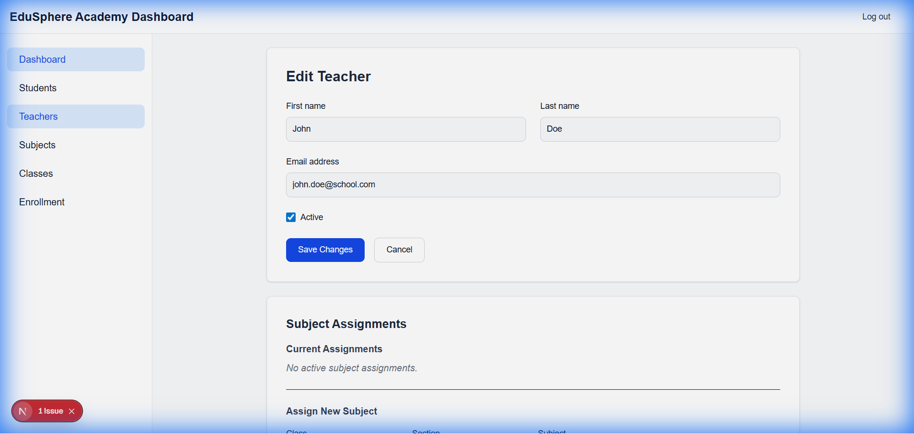
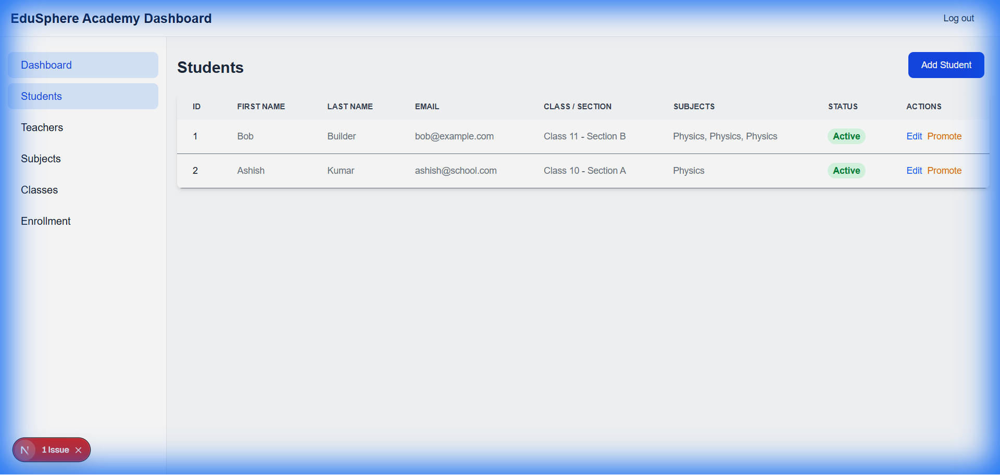
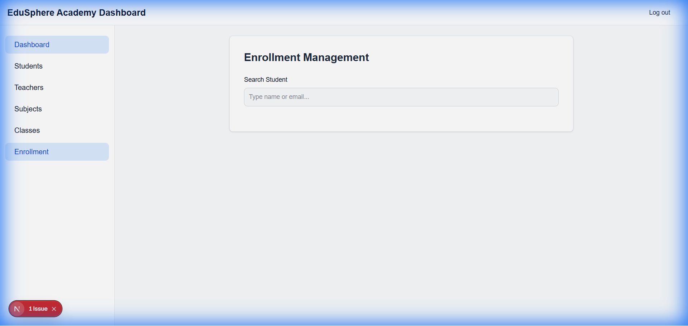

# Walkthrough - Teacher & Class Management Refinements

## Features Implemented

### 3. Teacher & Class Management
**Goal**: Enhance management of Teacher assignments (Class Teacher & Subjects) and their history.

**Changes**:
- **Class Teacher Assignment**:
  - Added dedicated UI in **Edit Class** to assign a Class Teacher.
  - Backend: `POST /classes/:id/teacher` updates the class and creates a `ClassTeacherHistory` record.
- **Subject Assignments**:
  - Added "Subject Assignments" section in **Edit Teacher**.
  - Allows assigning specific subjects to a teacher for a class/section.
- **Teacher History**:
  - New **History Page** (`/dashboard/teachers/:id/history`) displays:
    - Subject Assignment History.
    - Class Teacher Role History.

**Verification Steps**:
1.  **Assign Class Teacher**: Go to `Classes` -> `Edit Class` -> Select Teacher -> `Assign`.
2.  **Assign Subject**: Go to `Teachers` -> `Edit Teacher` -> "Assign New Subject" -> Select Class/Section/Subject -> `Assign`.
3.  **View History**: Go to `Teachers` -> `Actions` -> `View History`.

> [!IMPORTANT]
> **Backend Restart Required**: Due to changes in database entities (`ClassTeacherHistory`) and module structure (`TeachersModule`), you **must restart the backend server**.
> Run `Ctrl+C` in your backend terminal and then `npm run start:dev`.

## Previous Changes (Recap)
### 1. Student Promotion
- **Promote Page**: `/dashboard/students/[id]/promote`
- **Logic**: Validates promotion to a different class/section.

### 2. Edit Functionality
- **Edit Class**: Add/Edit/Delete sections.
- **Edit Student**: Edit basic details.
- **Edit Subject**: Edit basic details.

## Refinements (Teacher & Enrollment)

### Teacher Subject Assignment
- **Issue**: Dropdown was empty.
- **Fix**: Updated fetch endpoint to correct `/extra-subjects`.
- **Verification**: Dropdown now populates correctly.

### Student List Enhancements
- **Enhancement**: Added columns for "Class / Section" and "Subjects".
- **Verification**: Columns are visible and populate with data.

### Enrollment Multi-select
- **Enhancement**: Converted Subject selection to a multi-select checkbox list.
- **Implementation**: Updated backend to accept `subjectIds[]` and frontend to manage array state.
- **Status**: Implemented and page loads correctly.

## Handover Note
- **Project Status**: See [PROJECT_STATUS.md](PROJECT_STATUS.md) in the root directory for a detailed summary of completed features and pending tasks.
- **Git**: Code committed and pushed to `git@github.com:ashishpatel546/school-management-system.git` (Branch: `main`).
